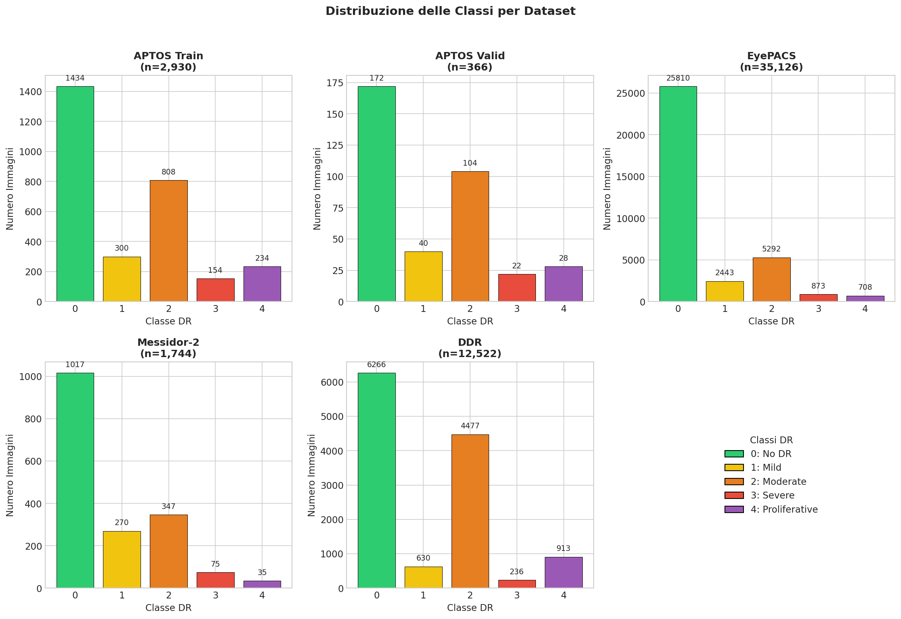
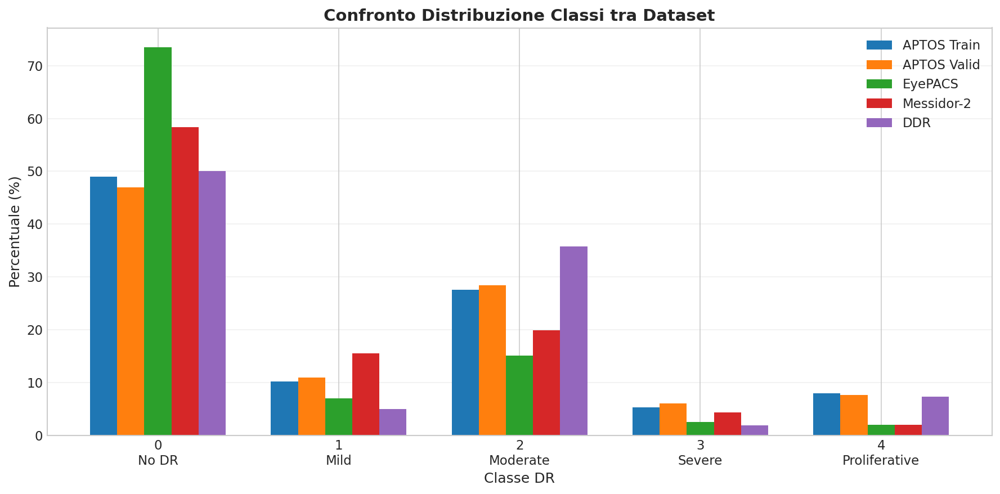
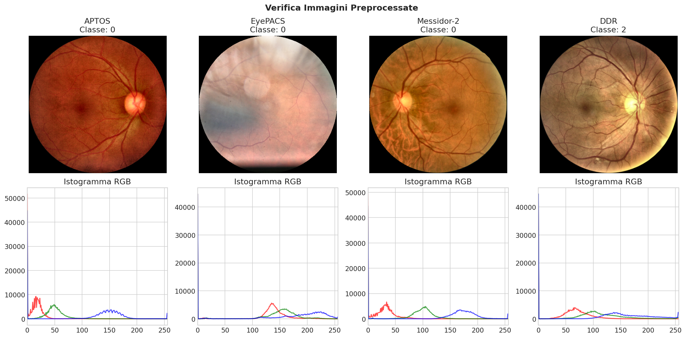

# Multi-Method Rule Extraction from Deep Learning for Interpretable Diabetic Retinopathy Grading

Progetto di Tesi di Laurea

**Autore:** Antonio Colamartino
**Email:** a.colamartino6@studenti.uniba.it
**Matricola:** 778730
**Universita:** Universita degli Studi di Bari Aldo Moro (UniBA)

---

## Descrizione

Questo progetto propone un sistema ibrido per la classificazione della retinopatia diabetica (Diabetic Retinopathy, DR) che combina le elevate prestazioni delle reti neurali profonde con l'interpretabilita delle regole estratte. L'obiettivo principale e sviluppare un sistema di supporto alle decisioni cliniche che sia sia accurato che comprensibile per i medici.

La retinopatia diabetica e una delle principali cause di cecità nel mondo e la sua diagnosi precoce e fondamentale per prevenire la perdita della vista. I modelli di deep learning hanno dimostrato eccellenti capacita predittive, ma la loro natura "black-box" limita l'adozione in ambito clinico dove la trasparenza delle decisioni e cruciale.

## Obiettivi

1. **Training di un modello CNN ad alte prestazioni** per la classificazione multi-classe della DR
2. **Analisi dell'explainability** tramite tecniche di saliency mapping e validazione quantitativa
3. **Estrazione di regole interpretabili** attraverso tre metodologie differenti
4. **Sviluppo di un sistema ibrido** che integri CNN e regole in modalita operative diverse

## Architettura del Progetto

### Fase 1 - Teacher CNN Training

| Componente | Specifica |
|------------|-----------|
| Architettura | EfficientNet-B5 (30M parametri) |
| Task | Multi-class classification (5 classi DR) |
| Classi | No DR, Mild, Moderate, Severe, Proliferative |
| Loss Function | Focal Loss + Label Smoothing (epsilon=0.1) |

### Fase 2 - Explainability Analysis

- **Saliency Maps:** Grad-CAM++ per la visualizzazione delle regioni rilevanti
- **Validazione Quantitativa:** Confronto tra Grad-CAM e ground-truth lesions (DDR dataset)
- **Clustering:** K-means su activation patterns per identificazione prototypes

### Fase 3 - Rule Extraction

Tre metodi comparati per l'estrazione di regole interpretabili:

| Metodo | Output |
|--------|--------|
| A - Decision Tree Distillation | Interpretable tree con if-then rules |
| B - LIME-based Rule Induction | Unordered rule set (CN2 Algorithm) |
| C - Activation Pattern Rules | Ordered rule list (RIPPER Algorithm) |

### Fase 4 - Sistema Ibrido

| Modalita | Strategia |
|----------|-----------|
| Post-hoc Explanation | CNN prediction con post-hoc rule explanation |
| Rule-guided Prediction | IF rule confidence > 0.8 THEN use rule ELSE use CNN |
| Ensemble Voting | CNN + all 3 rule-based predictors |

## Dataset

| Dataset | Immagini | Utilizzo |
|---------|----------|----------|
| APTOS 2019 | 3,662 | Training CNN |
| Kaggle EyePACS 2015 | 35,126 | Training CNN (merge per ~38,788 totali) |
| Messidor-2 | 1,744 | External validation (Testing) |
| DDR (lesion annotations) | 757 | XAI Validation (pixel-level masks) |

### Struttura della Cartella Data

```
Data/
├── APTOS2019/
│   ├── train_images/
│   ├── val_images/
│   ├── test_images/
│   ├── train_1.csv
│   ├── valid.csv
│   └── test.csv
├── EyePACS2015/
│   ├── train/
│   ├── test/
│   └── trainLabels.csv
├── messidor-2/
│   ├── images/
│   └── messidor_data.csv
└── DDR Dataset/
    └── DDR-dataset/
        ├── DR_grading/
        │   ├── train/
        │   ├── valid/
        │   ├── test/
        │   └── *.txt (annotations)
        ├── lesion_segmentation/
        │   ├── train/
        │   ├── valid/
        │   └── test/
        └── lesion_detection/
```

## Analisi Esplorativa dei Dati

L'analisi esplorativa dei dataset ha evidenziato le seguenti caratteristiche:

### Statistiche dei Dataset

| Dataset | Immagini Totali | Split |
|---------|-----------------|-------|
| APTOS 2019 | 3,296 | Train: 2,930 / Val: 366 |
| EyePACS 2015 | 35,126 | Train only |
| Messidor-2 | 1,744 | Test set esterno |
| DDR | 12,522 | Train: 6,265 / Val: 2,508 / Test: 3,749 |

**Dataset Combinato per Training:** 38,056 immagini (APTOS train + EyePACS)

### Distribuzione delle Classi

La distribuzione delle classi mostra un significativo sbilanciamento, tipico dei dataset medici:

| Classe | Nome | Immagini | Percentuale |
|--------|------|----------|-------------|
| 0 | No DR | 26,610 | 69.9% |
| 1 | Mild | 2,911 | 7.6% |
| 2 | Moderate | 6,152 | 16.2% |
| 3 | Severe | 1,092 | 2.9% |
| 4 | Proliferative | 1,291 | 3.4% |

**Rapporto di sbilanciamento massimo:** 28.9:1 (classe 0 vs classe 3)

### Visualizzazioni

#### Distribuzione per Dataset


#### Confronto tra Dataset


### Note sul Dataset DDR

Il dataset DDR contiene originariamente una classe 5 ("ungradable") che e stata esclusa dall'analisi in quanto non rappresenta un grado di severita della DR ma indica immagini non classificabili.

---

## Preprocessing delle Immagini

Tutte le immagini sono state preprocessate con una pipeline unificata per garantire consistenza tra i dataset.

### Pipeline di Preprocessing

| Step | Operazione | Descrizione |
|------|------------|-------------|
| 1 | Crop bordi neri | Rimozione automatica dei bordi scuri attorno alla retina |
| 2 | Resize | Ridimensionamento a 456x456 pixel (ottimale per EfficientNet-B5) |
| 3 | CLAHE | Contrast Limited Adaptive Histogram Equalization per migliorare il contrasto locale |
| 4 | Maschera circolare | Applicazione di una maschera circolare per uniformare le immagini |

### Parametri CLAHE

| Parametro | Valore |
|-----------|--------|
| Clip Limit | 2.0 |
| Grid Size | 8x8 |

### Statistiche Immagini Preprocessate

| Dataset | Immagini | Split |
|---------|----------|-------|
| APTOS | 3,296 | Train: 2,930 / Val: 366 |
| EyePACS | 35,126 | Train |
| Messidor-2 | 1,744 | Test |
| DDR | 12,522 | Train: 6,260 / Val: 2,503 / Test: 3,759 |

**Totale:** 52,688 immagini preprocessate

### Visualizzazione Pipeline


### Esempi di Immagini Preprocessate



---

## Metriche di Valutazione

| Categoria | Metrica |
|-----------|---------|
| CNN Teacher | Accuracy |
| CNN Teacher | Per-class F1-score |
| CNN Teacher | Cohen's Kappa |
| Rule Extraction | Rule Fidelity |
| Rule Extraction | Rule Complexity |
| Rule Extraction | Rule Coverage |
| XAI Validation | IoU (Grad-CAM vs lesion masks) |


## Contatti

**Antonio Colamartino**
Email: a.colamartino6@studenti.uniba.it
Universita degli Studi di Bari Aldo Moro
Matricola: 778730
