# Multi-Method Rule Extraction from Deep Learning for Interpretable Diabetic Retinopathy Grading

Progetto di Tesi di Laurea

**Autore:** Antonio Colamartino
**Email:** a.colamartino6@studenti.uniba.it
**Matricola:** 778730
**Università:** Università degli Studi di Bari Aldo Moro (UniBA)

---

## Descrizione

Questo progetto propone un sistema ibrido per la classificazione della retinopatia diabetica (Diabetic Retinopathy, DR) che combina le elevate prestazioni delle reti neurali profonde con l'interpretabilità delle regole estratte. L'obiettivo principale è sviluppare un sistema di supporto alle decisioni cliniche che sia sia accurato che comprensibile per i medici.

La retinopatia diabetica è una delle principali cause di cecità nel mondo e la sua diagnosi precoce è fondamentale per prevenire la perdita della vista. I modelli di deep learning hanno dimostrato eccellenti capacità predittive, ma la loro natura "black-box" limita l'adozione in ambito clinico dove la trasparenza delle decisioni è cruciale.

## Obiettivi

1. **Training di un modello CNN ad alte prestazioni** per la classificazione multi-classe della DR
2. **Analisi dell'explainability** tramite tecniche di saliency mapping e validazione quantitativa
3. **Estrazione di regole interpretabili** attraverso tre metodologie differenti
4. **Sviluppo di un sistema ibrido** che integri CNN e regole in modalità operative diverse

## Architettura del Progetto

### Fase 1 - Teacher CNN Training

| Componente    | Specifica                                    |
| ------------- | -------------------------------------------- |
| Architettura  | EfficientNet-B5 (30M parametri)              |
| Task          | Multi-class classification (5 classi DR)     |
| Classi        | No DR, Mild, Moderate, Severe, Proliferative |
| Loss Function | Focal Loss + Label Smoothing (epsilon=0.1)   |

### Fase 2 - Explainability Analysis

- **Saliency Maps:** Grad-CAM++ per la visualizzazione delle regioni rilevanti
- **Validazione Quantitativa:** Deletion/Insertion AUC, IoU con ground-truth lesions (DDR dataset)
- **Confronto Layer:** Analisi multi-layer per identificare il livello ottimale

### Fase 3 - Rule Extraction

Tre metodi comparati per l'estrazione di regole interpretabili:

| Metodo                         | Output                               |
| ------------------------------ | ------------------------------------ |
| A - Decision Tree Distillation | Interpretable tree con if-then rules |
| B - LIME-based Explanations    | Local interpretable explanations     |
| C - RIPPER One-vs-Rest         | Ordered rule list (RIPPER Algorithm) |

### Fase 4 - Sistema Ibrido

| Modalità               | Strategia                                                |
| ---------------------- | -------------------------------------------------------- |
| Post-hoc Explanation   | CNN prediction con post-hoc rule explanation via DT      |
| Rule-guided Prediction | IF DT confidence > threshold THEN use DT ELSE use CNN   |
| Weighted Ensemble      | alpha * CNN_proba + (1-alpha) * DT_proba                 |

## Dataset

| Dataset                  | Immagini | Utilizzo                                |
| ------------------------ | -------- | --------------------------------------- |
| APTOS 2019               | 3,296    | Training CNN (train + validation)       |
| Kaggle EyePACS 2015      | 35,126   | Training CNN (merge per 38,056 totali)  |
| Messidor-2               | 1,744    | External validation (Testing)           |
| DDR (lesion annotations) | 12,522   | XAI Validation (pixel-level masks)      |

### Struttura della Cartella Data

```
Data/
├── APTOS2019/
│   ├── train_images/
│   ├── val_images/
│   ├── test_images/
│   ├── train_1.csv
│   ├── valid.csv
│   └── test.csv
├── EyePACS2015/
│   ├── train/
│   ├── test/
│   └── trainLabels.csv
├── messidor-2/
│   ├── images/
│   └── messidor_data.csv
└── DDR Dataset/
    └── DDR-dataset/
        ├── DR_grading/
        │   ├── train/
        │   ├── valid/
        │   ├── test/
        │   └── *.txt (annotations)
        ├── lesion_segmentation/
        │   ├── train/
        │   ├── valid/
        │   └── test/
        └── lesion_detection/
```

## Analisi Esplorativa dei Dati

L'analisi esplorativa dei dataset ha evidenziato le seguenti caratteristiche:

### Statistiche dei Dataset

| Dataset      | Immagini Totali | Split                                   |
| ------------ | --------------- | --------------------------------------- |
| APTOS 2019   | 3,296           | Train: 2,930 / Val: 366                 |
| EyePACS 2015 | 35,126          | Train only                              |
| Messidor-2   | 1,744           | Test set esterno                        |
| DDR          | 12,522          | Train: 6,265 / Val: 2,508 / Test: 3,749 |

**Dataset Combinato per Training:** 38,056 immagini (APTOS train + EyePACS)

### Distribuzione delle Classi

La distribuzione delle classi nel dataset combinato di training mostra un significativo sbilanciamento, tipico dei dataset medici:

| Classe | Nome          | Immagini | Percentuale |
| ------ | ------------- | -------- | ----------- |
| 0      | No DR         | 27,244   | 71.6%       |
| 1      | Mild          | 2,743    | 7.2%        |
| 2      | Moderate      | 6,100    | 16.0%       |
| 3      | Severe        | 1,027    | 2.7%        |
| 4      | Proliferative | 942      | 2.5%        |

**Rapporto di sbilanciamento massimo:** 28.9:1 (classe 0 vs classe 4)

### Visualizzazioni

#### Distribuzione per Dataset

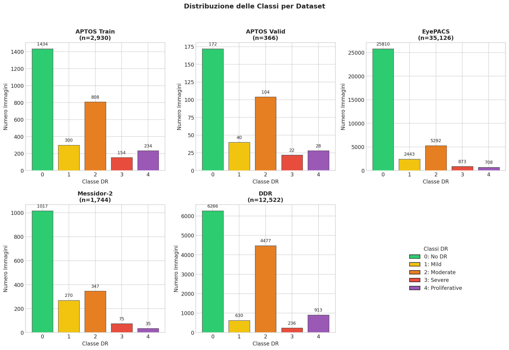

#### Confronto tra Dataset

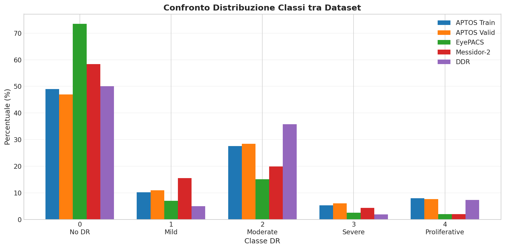

### Note sul Dataset DDR

Il dataset DDR contiene originariamente una classe 5 ("ungradable") che è stata esclusa dall'analisi in quanto non rappresenta un grado di severità della DR ma indica immagini non classificabili.

---

## Preprocessing delle Immagini

Tutte le immagini sono preprocessate con una pipeline configurabile tramite `config.yaml`. Le tecniche sono attivabili/disattivabili singolarmente.

### Pipeline di Preprocessing

| Step | Tecnica         | Descrizione                                                | Parametri                    |
| ---- | --------------- | ---------------------------------------------------------- | ---------------------------- |
| 1    | Crop bordi neri | Rimozione automatica dei bordi scuri attorno alla retina   | tolerance: 7                 |
| 2    | Resize          | Ridimensionamento mantenendo aspect ratio                  | 456x456, interpolation: area |
| 3    | CLAHE           | Contrast Limited Adaptive Histogram Equalization           | clip_limit: 2.0, grid: 8x8   |
| 4    | Ben Graham      | Sottrazione media locale per normalizzazione illuminazione | sigma: 10                    |
| 5    | Circle crop     | Maschera circolare per uniformare le immagini              | -                            |
| 6    | Normalize       | Normalizzazione con statistiche ImageNet                   | mean: [0.485, 0.456, 0.406]  |

### Configurazione (config.yaml)

```yaml
preprocessing:
  target_size: 456
  techniques:
    black_border_crop:
      enabled: true
      tolerance: 7
    resize:
      enabled: true
    clahe:
      enabled: true
      clip_limit: 2.0
    ben_graham:
      enabled: true
      sigma: 10
    circle_crop:
      enabled: true
    normalize:
      enabled: false
```

### Statistiche Immagini Preprocessate

| Dataset    | Immagini | Split                                   |
| ---------- | -------- | --------------------------------------- |
| APTOS      | 3,296    | Train: 2,930 / Val: 366                 |
| EyePACS    | 35,126   | Train                                   |
| Messidor-2 | 1,744    | Test                                    |
| DDR        | 12,522   | Train: 6,260 / Val: 2,503 / Test: 3,759 |

**Totale:** 52,688 immagini preprocessate

### Visualizzazione Pipeline

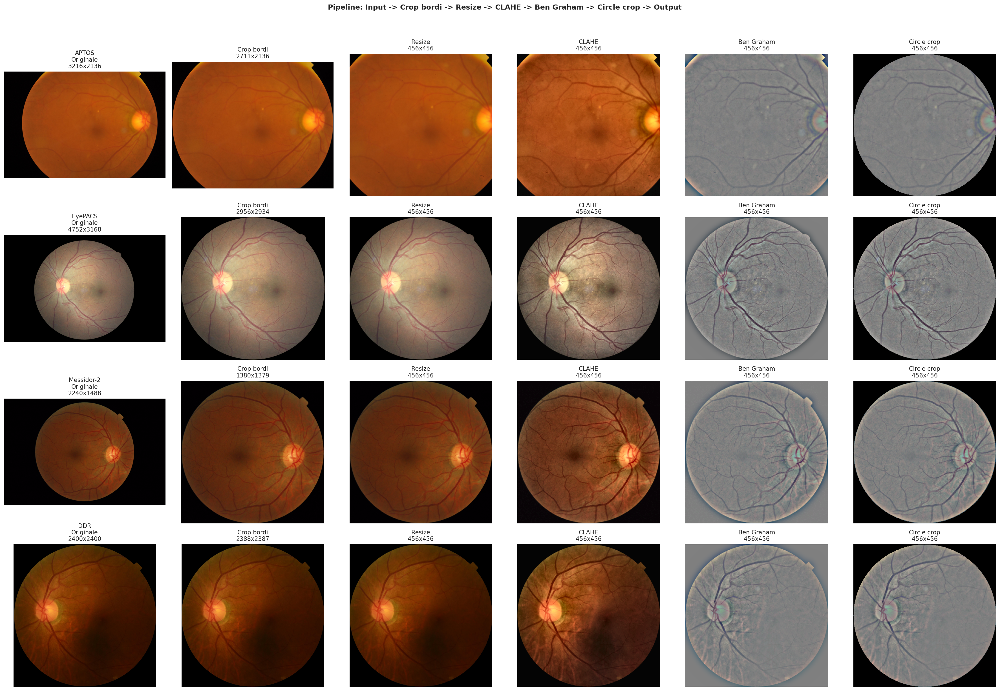

---

## Data Augmentation

Per migliorare la generalizzazione del modello e contrastare l'overfitting, viene applicata una pipeline di data augmentation durante il training.

### Trasformazioni Applicate

| Trasformazione      | Parametri               | Probabilità |
| ------------------- | ----------------------- | ------------ |
| Horizontal Flip     | -                       | 50%          |
| Vertical Flip       | -                       | 50%          |
| Rotazione           | limite 180 gradi        | 50%          |
| Brightness/Contrast | +/- 20%                 | 30%          |
| Hue/Saturation      | hue +/- 10, sat +/- 20% | 30%          |

### Gestione Class Imbalance

Data la forte sproporzione tra le classi, vengono utilizzati class weights per bilanciare la loss function:

| Classe | Nome          | Weight |
| ------ | ------------- | ------ |
| 0      | No DR         | 0.28   |
| 1      | Mild          | 2.77   |
| 2      | Moderate      | 1.25   |
| 3      | Severe        | 7.43   |
| 4      | Proliferative | 8.44   |

### Esempi di Augmentation

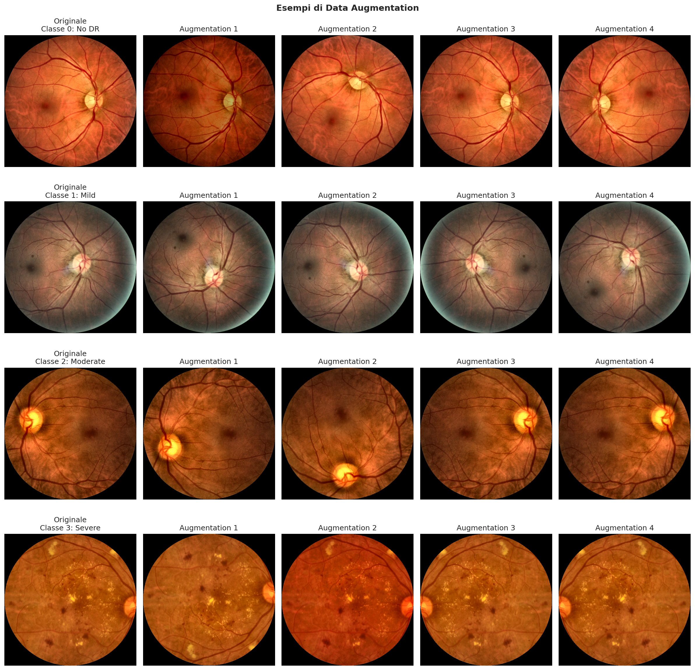

---

## Training del Modello

### Configurazione Training

| Parametro       | Valore                                         |
| --------------- | ---------------------------------------------- |
| Architettura    | EfficientNet-B5                                |
| Input size      | 456x456                                        |
| Batch size      | 16                                             |
| Optimizer       | AdamW                                          |
| Learning rate   | 1e-4                                           |
| Scheduler       | Cosine Annealing con Warmup (2 epoche)         |
| Loss function   | Focal Loss (gamma=2.0) + Label Smoothing (0.1) |
| Early stopping  | Patience 7 su val_kappa                        |
| Mixed precision | AMP abilitato                                  |

### Strategia di Training

1. **Freeze backbone** (3 epoche): Solo il classificatore viene trainato
2. **Unfreeze** (epoche successive): Fine-tuning di tutta la rete
3. **Early stopping**: Interrompe il training quando val_kappa non migliora per 7 epoche

### Risultati Training

| Set                | Accuracy | Cohen's Kappa | F1 Macro | F1 Weighted |
| ------------------ | -------- | ------------- | -------- | ----------- |
| Validation (APTOS) | 82.5%    | 0.909         | 0.662    | 0.816       |
| Test (Messidor-2)  | 67.1%    | 0.745         | 0.643    | 0.690       |

### F1-Score per Classe

| Classe | Nome          | Validation | Test  |
| ------ | ------------- | ---------- | ----- |
| 0      | No DR         | 0.979      | 0.777 |
| 1      | Mild          | 0.610      | 0.398 |
| 2      | Moderate      | 0.775      | 0.671 |
| 3      | Severe        | 0.207      | 0.632 |
| 4      | Proliferative | 0.737      | 0.735 |

### Curve di Training

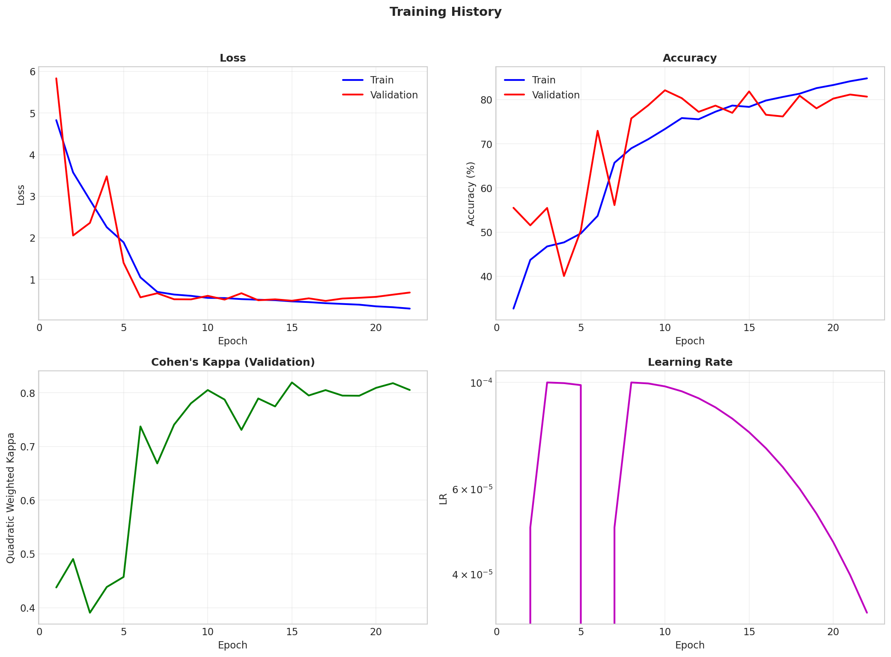

### Matrici di Confusione

#### Validation Set (APTOS)

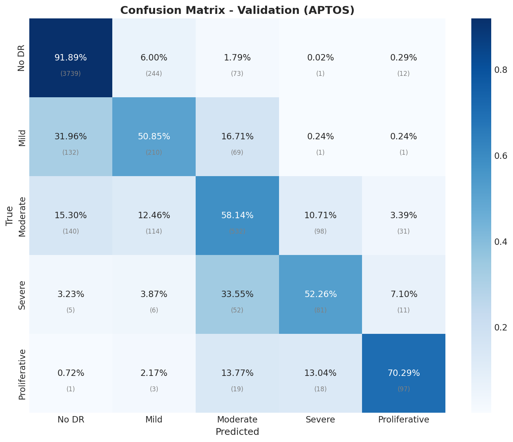

#### Test Set (Messidor-2)

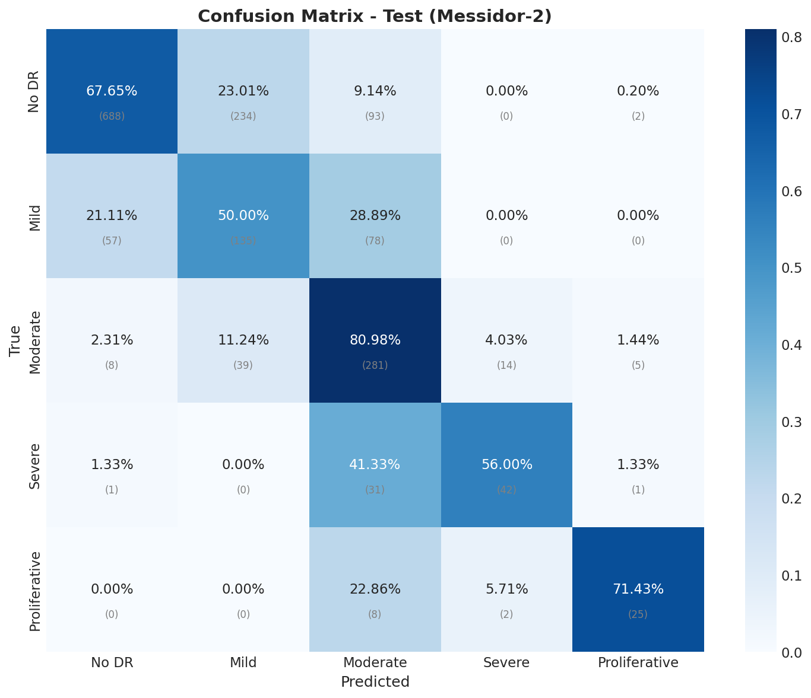

### Artefatti Generati

| File                               | Descrizione                     |
| ---------------------------------- | ------------------------------- |
| `checkpoints/best_model_*.pt`    | Modello con miglior val_kappa   |
| `checkpoints/last_model_*.pt`    | Ultimo modello trainato         |
| `results/training_history.png`   | Curve loss, accuracy, kappa, LR |
| `results/confusion_matrix_*.png` | Matrici di confusione           |
| `results/final_metrics_*.json`   | Metriche finali                 |

---

## Explainability Analysis (Grad-CAM++)

### Approccio

Grad-CAM++ viene utilizzato per generare saliency maps che evidenziano le regioni dell'immagine più rilevanti per la predizione del modello. L'analisi è stata condotta su tre layer della rete per identificare il livello ottimale di astrazione.

### Confronto Layer

Sono stati confrontati tre layer di EfficientNet-B5 per determinare quale produce le mappe di attivazione più informative:

| Layer              | Risoluzione | Deletion AUC | Insertion AUC | Composite Score |
| ------------------ | ----------- | ------------ | ------------- | --------------- |
| blocks.2           | 57x57       | 0.388        | 0.428         | -               |
| **blocks.4**       | **29x29**   | **0.330**    | **0.454**     | **0.125**       |
| bn2                | 15x15       | 0.436        | 0.483         | -               |

**Layer selezionato:** `blocks.4` (29x29) sulla base del composite score (Insertion AUC - Deletion AUC), che bilancia la capacità di identificare regioni rilevanti (alta Insertion) con la specificità (bassa Deletion).

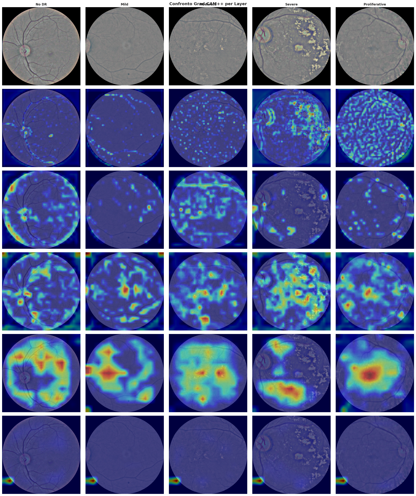

### Deletion/Insertion AUC per Classe

| Classe        | Deletion AUC | Insertion AUC |
| ------------- | ------------ | ------------- |
| No DR         | 0.622        | 0.606         |
| Mild          | 0.344        | 0.400         |
| Moderate      | 0.195        | 0.333         |
| Severe        | 0.145        | 0.317         |
| Proliferative | 0.341        | 0.614         |
| **Overall**   | **0.330**    | **0.454**     |

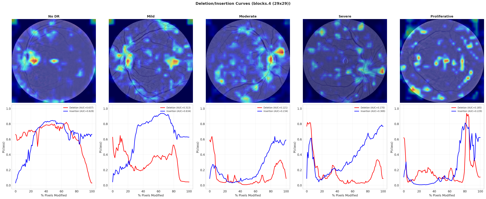

### Validazione con Ground Truth (DDR Dataset)

La validazione quantitativa è stata condotta su 100 immagini del dataset DDR con annotazioni pixel-level delle lesioni:

| Metrica                 | Valore          |
| ----------------------- | --------------- |
| Pointing Game Accuracy  | 14.0%           |
| IoU medio (threshold 0.3) | 0.039         |
| IoU medio (threshold 0.5) | 0.045         |
| IoU medio (threshold 0.7) | 0.036         |

I bassi valori di IoU indicano che Grad-CAM++ cattura regioni più ampie rispetto alle annotazioni puntuali delle singole lesioni, un comportamento atteso poiché il modello apprende pattern contestuali e non solo la localizzazione precisa delle lesioni.

### Visualizzazioni

#### Grad-CAM++ Grid per Classe

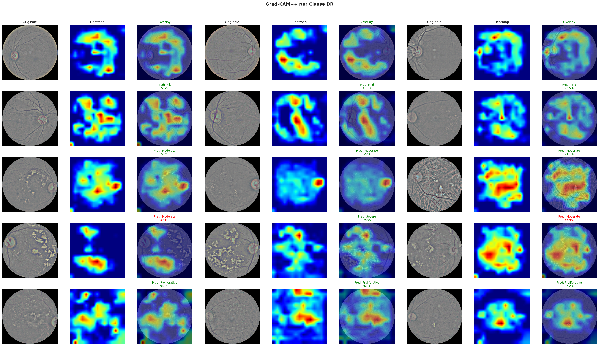

#### Mean Heatmap per Classe

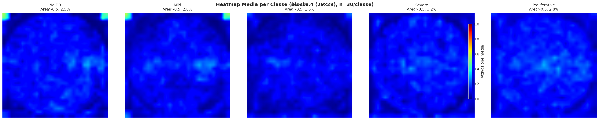

#### Grad-CAM++ vs Ground Truth (DDR)

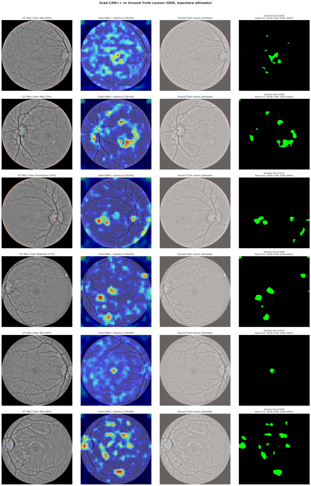

---

## Rule Extraction

### Approccio

L'estrazione di regole interpretabili avviene in tre fasi: (1) estrazione delle features dal penultimo layer della CNN (2048 dimensioni), (2) riduzione dimensionale via PCA, (3) training di modelli interpretabili sulle predizioni della CNN (knowledge distillation).

### PCA - Riduzione Dimensionale

| Parametro                | Valore |
| ------------------------ | ------ |
| Features originali       | 2,048  |
| Componenti PCA           | 12     |
| Varianza spiegata        | 95.2%  |

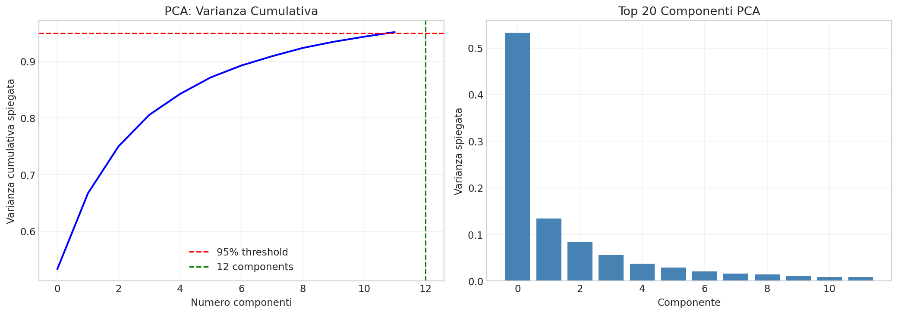

### Metodo A: Decision Tree Distillation

Il Decision Tree viene trainato per replicare le predizioni della CNN (non le label originali), massimizzando la fidelity.

#### Risultati Decision Tree (depth=12)

| Metrica        | Validation | Test   |
| -------------- | ---------- | ------ |
| Fidelity       | 92.6%      | 88.2%  |
| Accuracy       | 84.3%      | 65.8%  |
| F1 Macro       | 0.718      | 0.622  |

| Complessità    | Valore |
| -------------- | ------ |
| Nodi totali    | 1,909  |
| Foglie         | 955    |
| Profondità max | 12     |

#### Fidelity per Classe (Test)

| Classe        | Fidelity |
| ------------- | -------- |
| No DR         | 93.9%    |
| Mild          | 83.3%    |
| Moderate      | 83.7%    |
| Severe        | 87.7%    |
| Proliferative | 84.8%    |

#### Ablation Study - Profondità DT

| Depth | Nodi  | Foglie | Fidelity Val | Fidelity Test |
| ----- | ----- | ------ | ------------ | ------------- |
| 4     | 31    | 16     | 87.6%        | 76.3%         |
| 6     | 127   | 64     | 90.9%        | 82.7%         |
| 8     | 433   | 217    | 92.0%        | 85.8%         |
| 10    | 1,091 | 546    | 92.7%        | 87.7%         |
| 12    | 1,909 | 955    | 92.6%        | 88.2%         |
| 16    | 2,763 | 1,382  | 92.2%        | 88.3%         |

La fidelity si stabilizza a depth 10-12, con rendimenti marginali decrescenti per profondità superiori.

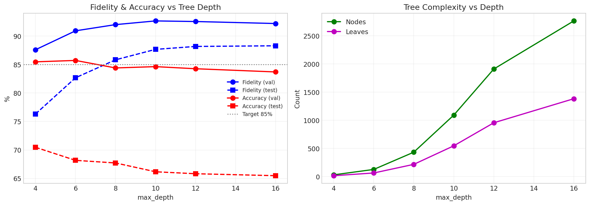

### Metodo B: RIPPER One-vs-Rest

L'algoritmo RIPPER genera regole compatte in formato if-then per ciascuna classe.

#### Risultati RIPPER

| Metrica        | Validation | Test   |
| -------------- | ---------- | ------ |
| Fidelity       | 79.8%      | 63.0%  |
| Accuracy       | 81.6%      | 68.2%  |
| F1 Macro       | 0.614      | 0.558  |

| Complessità         | Valore |
| ------------------- | ------ |
| Numero regole       | 48     |
| Condizioni totali   | 48     |
| Media condizioni    | 1.0    |

### Metodo C: LIME Local Explanations

LIME fornisce spiegazioni locali per singole predizioni, complementando gli approcci globali di DT e RIPPER.

| Parametro               | Valore        |
| ------------------------ | ------------- |
| Campioni per spiegazione | 1,000         |
| Immagini spiegate        | 25            |
| Stability IoU (media)    | 0.263 ± 0.125 |
| Runs per stabilità       | 5             |

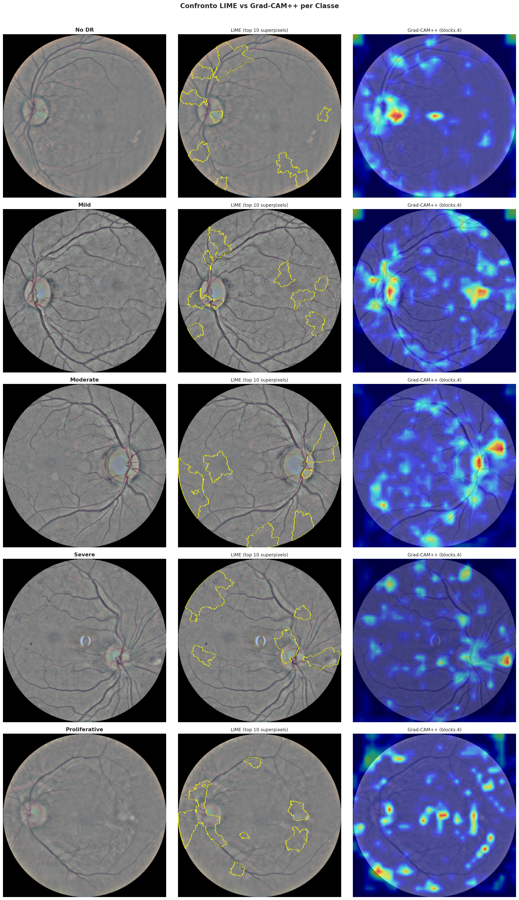

### Confronto Metodi

| Metrica           | Decision Tree (d=12) | RIPPER      |
| ----------------- | -------------------- | ----------- |
| Fidelity (val)    | 92.6%                | 79.8%       |
| Fidelity (test)   | 88.2%                | 63.0%       |
| Accuracy (test)   | 65.8%                | 68.2%       |
| F1 Macro (test)   | 0.622                | 0.558       |
| Complessità       | 1,909 nodi           | 48 regole   |
| Interpretabilità  | Media                | Alta        |

Il Decision Tree raggiunge la fidelity più alta (92.6%), rendendolo il candidato ideale per la spiegazione post-hoc delle predizioni CNN. RIPPER privilegia la compattezza (48 regole vs 955 foglie) al costo di una fidelity inferiore.

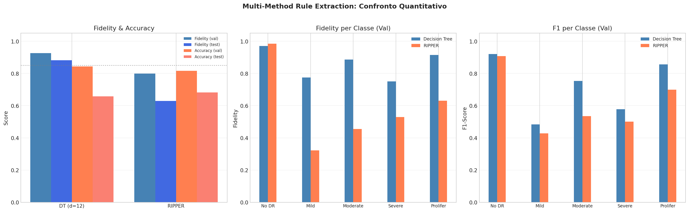

---

## Sistema Ibrido

### Approccio

Il sistema ibrido integra la CNN teacher con i modelli a regole attraverso tre strategie operative, ciascuna con un diverso trade-off tra performance e interpretabilità.

### Strategia 1: Post-hoc Explanation

La CNN produce la predizione; il Decision Tree fornisce una spiegazione in forma di regola. La copertura indica la percentuale di predizioni CNN fedelmente replicate dal DT.

| Metrica                    | Valore |
| -------------------------- | ------ |
| Coverage (agreement CNN-DT) | 88.2%  |
| Lunghezza media regola     | 11.2   |

#### Agreement per Classe (Test)

| Classe        | Agreement |
| ------------- | --------- |
| No DR         | 93.9%     |
| Mild          | 83.3%     |
| Moderate      | 83.7%     |
| Severe        | 87.7%     |
| Proliferative | 84.8%     |

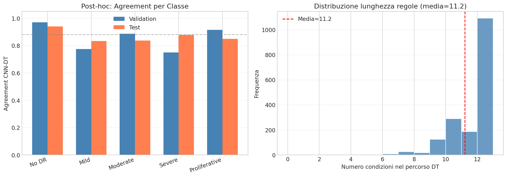

### Strategia 2: Rule-Guided Classification

Il Decision Tree classifica se la sua confidenza supera una soglia; altrimenti la CNN decide.

| Parametro          | Valore |
| ------------------ | ------ |
| Soglia ottimale    | 0.575  |
| Coverage DT        | 99.4%  |
| Accuracy           | 66.1%  |
| F1 Macro           | 0.623  |
| Fidelity vs CNN    | 88.6%  |

L'alta coverage del DT (99.4%) indica che il DT è quasi sempre confidente, lasciando poco spazio alla CNN per intervenire.

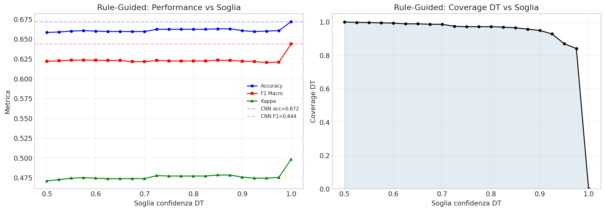

### Strategia 3: Weighted Ensemble

Combinazione pesata delle probabilità: `alpha * CNN_proba + (1-alpha) * DT_proba`.

| Parametro       | Valore |
| --------------- | ------ |
| Alpha ottimale  | 1.0    |
| Accuracy        | 67.2%  |
| F1 Macro        | 0.644  |

Il valore ottimale di alpha=1.0 (pura CNN) indica che il DT non migliora le performance predittive della CNN. Il valore del DT risiede nell'interpretabilità, non nel miglioramento predittivo.

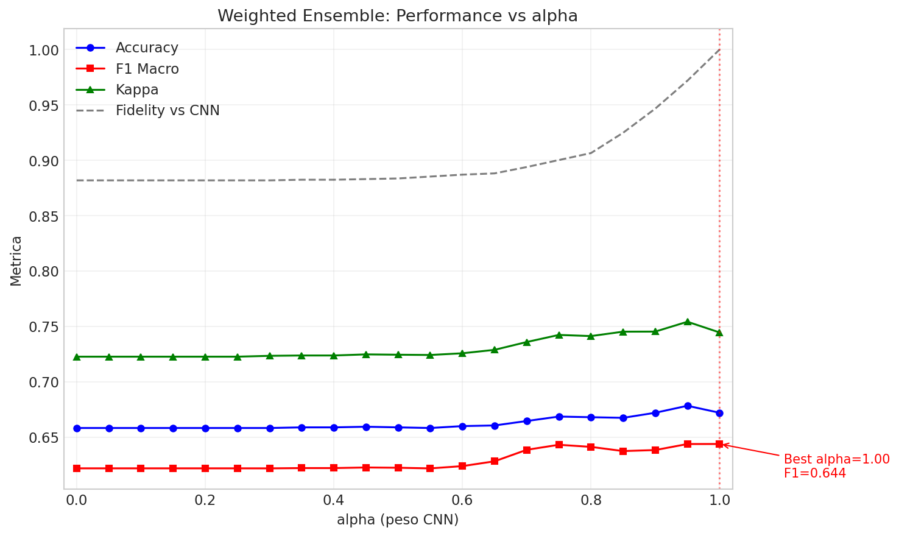

### Confronto Strategie

| Strategia                | Accuracy | F1 Macro | Kappa |
| ------------------------ | -------- | -------- | ----- |
| CNN-only                 | 67.2%    | 0.644    | 0.498 |
| DT-only (d=12)           | 65.8%    | 0.622    | 0.471 |
| RIPPER-only              | 68.2%    | 0.558    | 0.408 |
| Post-hoc (CNN + DT expl) | 67.2%    | 0.644    | 0.498 |
| Rule-Guided (t=0.575)    | 66.1%    | 0.623    | 0.475 |
| Ensemble (alpha=1.0)     | 67.2%    | 0.644    | 0.498 |

La strategia **Post-hoc Explanation** risulta ottimale: mantiene le performance della CNN e fornisce spiegazioni in forma di regola per l'88.2% delle predizioni.

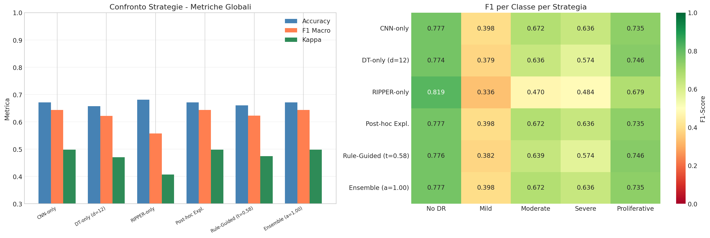

### Agreement Analysis

| Coppia          | Agreement |
| --------------- | --------- |
| CNN - DT        | 88.2%     |
| CNN - RIPPER    | 63.0%     |
| DT - RIPPER     | 64.1%     |
| Tutti unanimi   | 59.0%     |

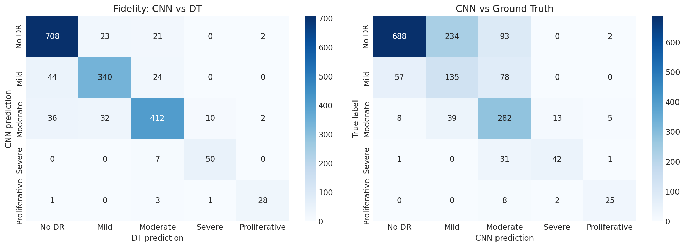

---

## Metriche di Valutazione

| Categoria          | Metrica                             | Descrizione                                           |
| ------------------ | ----------------------------------- | ----------------------------------------------------- |
| CNN Teacher        | Accuracy                            | Percentuale predizioni corrette                       |
| CNN Teacher        | Per-class F1-score                  | Precisione/recall bilanciate per classe               |
| CNN Teacher        | Cohen's Kappa (quadratic weighted)  | Concordanza pesata per classi ordinali                |
| Explainability     | Deletion AUC                        | Calo performance rimuovendo pixel rilevanti           |
| Explainability     | Insertion AUC                       | Crescita performance aggiungendo pixel rilevanti      |
| Explainability     | IoU (Grad-CAM vs lesion masks)      | Sovrapposizione con annotazioni ground-truth          |
| Rule Extraction    | Fidelity                            | Concordanza regole-CNN (knowledge distillation)       |
| Rule Extraction    | Rule Complexity                     | Numero nodi/regole del modello interpretabile         |
| Sistema Ibrido     | Coverage                            | Percentuale predizioni spiegabili                     |

## Struttura del Progetto

```
multi-method-xai-diabetic-retinopathy/
├── notebooks/
│   ├── 01_data_exploration.ipynb       # Analisi esplorativa dei dataset
│   ├── 02_preprocessing.ipynb          # Pipeline di preprocessing
│   ├── 03_augmentation.ipynb           # Data augmentation e class balancing
│   ├── 04_analysis.ipynb               # Training del modello CNN
│   ├── 05_gradcam.ipynb                # Grad-CAM++ e validazione quantitativa
│   ├── 06_rule_extraction.ipynb        # Estrazione regole (DT, RIPPER, LIME)
│   └── 07_hybrid_system.ipynb          # Sistema ibrido (3 strategie)
├── scripts/                            # Script di utilità
├── checkpoints/                        # Modelli salvati
├── results/                            # Risultati e visualizzazioni
│   ├── gradcam/                        # Saliency maps e confronti
│   ├── gradcam_validation/             # Validazione con DDR ground truth
│   ├── rule_extraction/                # Metriche e plot rule extraction
│   └── hybrid_system/                  # Risultati sistema ibrido
├── config.yaml                         # Configurazione centralizzata
├── requirements.txt                    # Dipendenze Python
└── README.md
```

## Contatti

**Antonio Colamartino**
Email: a.colamartino6@studenti.uniba.it
Università degli Studi di Bari Aldo Moro
Matricola: 778730
