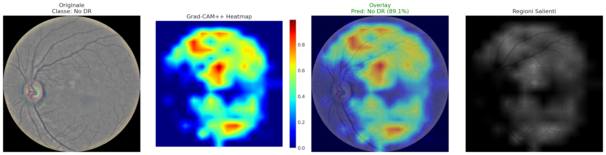
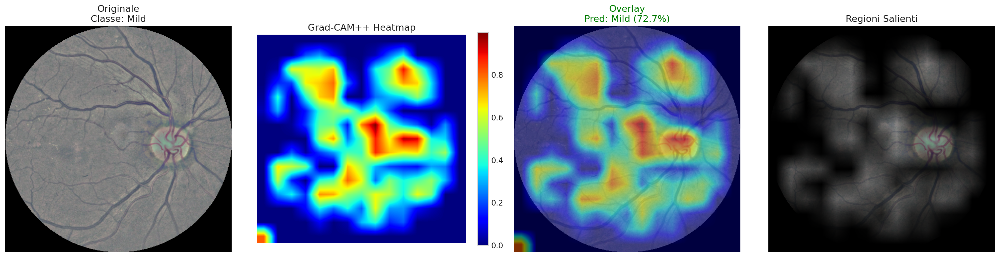
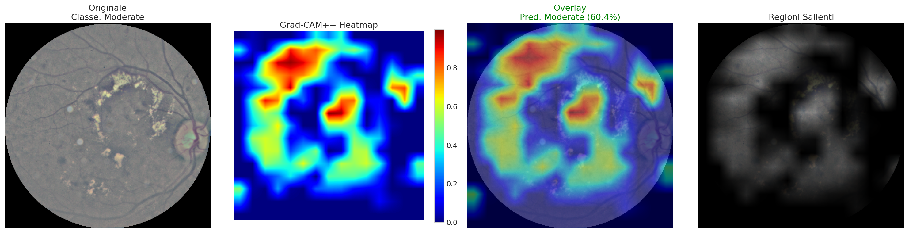
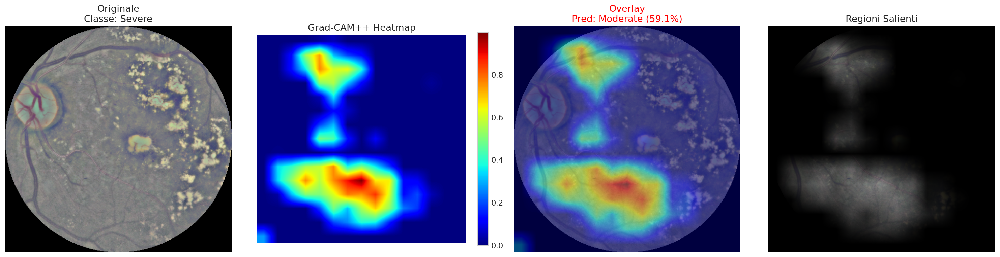
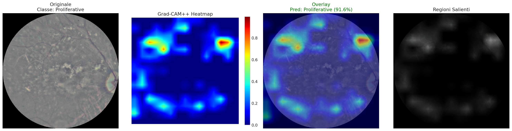

# Multi-Method Rule Extraction from Deep Learning for Interpretable Diabetic Retinopathy Grading

Progetto di Tesi di Laurea

**Autore:** Antonio Colamartino
**Email:** a.colamartino6@studenti.uniba.it
**Matricola:** 778730
**Università:** Università degli Studi di Bari Aldo Moro (UniBA)

---

## Descrizione

Questo progetto propone un sistema ibrido per la classificazione della retinopatia diabetica (Diabetic Retinopathy, DR) che combina le elevate prestazioni delle reti neurali profonde con l'interpretabilità delle regole estratte. L'obiettivo principale è sviluppare un sistema di supporto alle decisioni cliniche che sia sia accurato che comprensibile per i medici.

La retinopatia diabetica è una delle principali cause di cecità nel mondo e la sua diagnosi precoce è fondamentale per prevenire la perdita della vista. I modelli di deep learning hanno dimostrato eccellenti capacità predittive, ma la loro natura "black-box" limita l'adozione in ambito clinico dove la trasparenza delle decisioni è cruciale.

## Obiettivi

1. **Training di un modello CNN ad alte prestazioni** per la classificazione multi-classe della DR
2. **Analisi dell'explainability** tramite tecniche di saliency mapping e validazione quantitativa
3. **Estrazione di regole interpretabili** attraverso tre metodologie differenti
4. **Sviluppo di un sistema ibrido** che integri CNN e regole in modalità operative diverse

## Architettura del Progetto

### Fase 1 - Teacher CNN Training

| Componente    | Specifica                                    |
| ------------- | -------------------------------------------- |
| Architettura  | EfficientNet-B5 (30M parametri)              |
| Task          | Multi-class classification (5 classi DR)     |
| Classi        | No DR, Mild, Moderate, Severe, Proliferative |
| Loss Function | Focal Loss + Label Smoothing (epsilon=0.1)   |

### Fase 2 - Explainability Analysis

- **Saliency Maps:** Grad-CAM++ per la visualizzazione delle regioni rilevanti
- **Validazione Quantitativa:** Confronto tra Grad-CAM e ground-truth lesions (DDR dataset)
- **Clustering:** K-means su activation patterns per identificazione prototypes

### Fase 3 - Rule Extraction

Tre metodi comparati per l'estrazione di regole interpretabili:

| Metodo                         | Output                               |
| ------------------------------ | ------------------------------------ |
| A - Decision Tree Distillation | Interpretable tree con if-then rules |
| B - LIME-based Rule Induction  | Unordered rule set (CN2 Algorithm)   |
| C - Activation Pattern Rules   | Ordered rule list (RIPPER Algorithm) |

### Fase 4 - Sistema Ibrido

| Modalità              | Strategia                                           |
| ---------------------- | --------------------------------------------------- |
| Post-hoc Explanation   | CNN prediction con post-hoc rule explanation        |
| Rule-guided Prediction | IF rule confidence > 0.8 THEN use rule ELSE use CNN |
| Ensemble Voting        | CNN + all 3 rule-based predictors                   |

## Dataset

| Dataset                  | Immagini | Utilizzo                                |
| ------------------------ | -------- | --------------------------------------- |
| APTOS 2019               | 3,662    | Training CNN                            |
| Kaggle EyePACS 2015      | 35,126   | Training CNN (merge per ~38,788 totali) |
| Messidor-2               | 1,744    | External validation (Testing)           |
| DDR (lesion annotations) | 757      | XAI Validation (pixel-level masks)      |

### Struttura della Cartella Data

```
Data/
├── APTOS2019/
│   ├── train_images/
│   ├── val_images/
│   ├── test_images/
│   ├── train_1.csv
│   ├── valid.csv
│   └── test.csv
├── EyePACS2015/
│   ├── train/
│   ├── test/
│   └── trainLabels.csv
├── messidor-2/
│   ├── images/
│   └── messidor_data.csv
└── DDR Dataset/
    └── DDR-dataset/
        ├── DR_grading/
        │   ├── train/
        │   ├── valid/
        │   ├── test/
        │   └── *.txt (annotations)
        ├── lesion_segmentation/
        │   ├── train/
        │   ├── valid/
        │   └── test/
        └── lesion_detection/
```

## Analisi Esplorativa dei Dati

L'analisi esplorativa dei dataset ha evidenziato le seguenti caratteristiche:

### Statistiche dei Dataset

| Dataset      | Immagini Totali | Split                                   |
| ------------ | --------------- | --------------------------------------- |
| APTOS 2019   | 3,296           | Train: 2,930 / Val: 366                 |
| EyePACS 2015 | 35,126          | Train only                              |
| Messidor-2   | 1,744           | Test set esterno                        |
| DDR          | 12,522          | Train: 6,265 / Val: 2,508 / Test: 3,749 |

**Dataset Combinato per Training:** 38,056 immagini (APTOS train + EyePACS)

### Distribuzione delle Classi

La distribuzione delle classi mostra un significativo sbilanciamento, tipico dei dataset medici:

| Classe | Nome          | Immagini | Percentuale |
| ------ | ------------- | -------- | ----------- |
| 0      | No DR         | 26,610   | 69.9%       |
| 1      | Mild          | 2,911    | 7.6%        |
| 2      | Moderate      | 6,152    | 16.2%       |
| 3      | Severe        | 1,092    | 2.9%        |
| 4      | Proliferative | 1,291    | 3.4%        |

**Rapporto di sbilanciamento massimo:** 28.9:1 (classe 0 vs classe 3)

### Visualizzazioni

#### Distribuzione per Dataset


#### Confronto tra Dataset


### Note sul Dataset DDR

Il dataset DDR contiene originariamente una classe 5 ("ungradable") che è stata esclusa dall'analisi in quanto non rappresenta un grado di severità della DR ma indica immagini non classificabili.

---

## Preprocessing delle Immagini

Tutte le immagini sono preprocessate con una pipeline configurabile tramite `config.yaml`. Le tecniche sono attivabili/disattivabili singolarmente.

### Pipeline di Preprocessing

| Step | Tecnica         | Descrizione                                                | Parametri                    |
| ---- | --------------- | ---------------------------------------------------------- | ---------------------------- |
| 1    | Crop bordi neri | Rimozione automatica dei bordi scuri attorno alla retina   | tolerance: 7                 |
| 2    | Resize          | Ridimensionamento mantenendo aspect ratio                  | 456x456, interpolation: area |
| 3    | CLAHE           | Contrast Limited Adaptive Histogram Equalization           | clip_limit: 2.0, grid: 8x8   |
| 4    | Ben Graham      | Sottrazione media locale per normalizzazione illuminazione | sigma: 10                    |
| 5    | Circle crop     | Maschera circolare per uniformare le immagini              | -                            |
| 6    | Normalize       | Normalizzazione con statistiche ImageNet                   | mean: [0.485, 0.456, 0.406]  |

### Configurazione (config.yaml)

```yaml
preprocessing:
  target_size: 456
  techniques:
    black_border_crop:
      enabled: true
      tolerance: 7
    resize:
      enabled: true
    clahe:
      enabled: true
      clip_limit: 2.0
    ben_graham:
      enabled: true
      sigma: 10
    circle_crop:
      enabled: true
    normalize:
      enabled: false
```

### Statistiche Immagini Preprocessate

| Dataset    | Immagini | Split                                   |
| ---------- | -------- | --------------------------------------- |
| APTOS      | 3,296    | Train: 2,930 / Val: 366                 |
| EyePACS    | 35,126   | Train                                   |
| Messidor-2 | 1,744    | Test                                    |
| DDR        | 12,522   | Train: 6,260 / Val: 2,503 / Test: 3,759 |

**Totale:** 52,688 immagini preprocessate

### Visualizzazione Pipeline


---


## Data Augmentation

Per migliorare la generalizzazione del modello e contrastare l'overfitting, viene applicata una pipeline di data augmentation durante il training.

### Trasformazioni Applicate

| Trasformazione      | Parametri               | Probabilità |
| ------------------- | ----------------------- | ------------ |
| Horizontal Flip     | -                       | 50%          |
| Vertical Flip       | -                       | 50%          |
| Rotazione           | limite 180 gradi        | 50%          |
| Brightness/Contrast | +/- 20%                 | 30%          |
| Hue/Saturation      | hue +/- 10, sat +/- 20% | 30%          |

### Gestione Class Imbalance

Data la forte sproporzione tra le classi, vengono utilizzati class weights per bilanciare la loss function:

| Classe | Nome          | Weight |
| ------ | ------------- | ------ |
| 0      | No DR         | 0.28   |
| 1      | Mild          | 2.77   |
| 2      | Moderate      | 1.25   |
| 3      | Severe        | 7.41   |
| 4      | Proliferative | 8.08   |

### Esempi di Augmentation


---

## Training del Modello

### Configurazione Training

| Parametro | Valore |
| --------- | ------ |
| Architettura | EfficientNet-B5 |
| Input size | 456x456 |
| Batch size | 16 |
| Optimizer | AdamW |
| Learning rate | 1e-4 |
| Scheduler | Cosine Annealing con Warmup (2 epoche) |
| Loss function | Focal Loss (gamma=2.0) + Label Smoothing (0.1) |
| Early stopping | Patience 7 su val_kappa |
| Mixed precision | AMP abilitato |

### Strategia di Training

1. **Freeze backbone** (3 epoche): Solo il classificatore viene trainato
2. **Unfreeze** (epoche successive): Fine-tuning di tutta la rete
3. **Early stopping**: Interrompe il training quando val_kappa non migliora per 7 epoche

### Risultati Training

| Set | Accuracy | Cohen's Kappa | F1 Macro | F1 Weighted |
| --- | -------- | ------------- | -------- | ----------- |
| Validation (APTOS) | 82.5% | 0.909 | 0.662 | 0.816 |
| Test (Messidor-2) | 67.1% | 0.745 | 0.643 | 0.690 |

### F1-Score per Classe

| Classe | Nome | Validation | Test |
| ------ | ---- | ---------- | ---- |
| 0 | No DR | 0.979 | 0.777 |
| 1 | Mild | 0.610 | 0.398 |
| 2 | Moderate | 0.775 | 0.671 |
| 3 | Severe | 0.207 | 0.632 |
| 4 | Proliferative | 0.737 | 0.735 |

### Curve di Training


### Matrici di Confusione

#### Validation Set (APTOS)


#### Test Set (Messidor-2)


### Artefatti Generati

| File | Descrizione |
| ---- | ----------- |
| `checkpoints/best_model_*.pt` | Modello con miglior val_kappa |
| `checkpoints/last_model_*.pt` | Ultimo modello trainato |
| `results/training_history.png` | Curve loss, accuracy, kappa, LR |
| `results/confusion_matrix_*.png` | Matrici di confusione |
| `results/final_metrics_*.json` | Metriche finali |

---

## Explainability: Grad-CAM++

### Metodo

Grad-CAM++ (Gradient-weighted Class Activation Mapping++) genera mappe di salienza che evidenziano le regioni dell'immagine rilevanti per la predizione del modello.

**Reference**: Chattopadhyay et al., "Grad-CAM++: Generalized Gradient-based Visual Explanations for Deep Convolutional Networks", WACV 2018

### Configurazione

| Parametro | Valore |
| --------- | ------ |
| Target layer | blocks.5 (EfficientNet-B5) |
| Colormap | jet |
| Alpha overlay | 0.5 |
| Campioni per classe | 3 |

### Confronto Layer

Sono stati testati diversi layer per identificare il livello ottimale di astrazione:


- **Layer superficiali** (blocks.2-3): Features low-level (edges, texture)
- **Layer profondi** (blocks.5-6): Features high-level (strutture anatomiche, lesioni)

Il layer `blocks.5` offre il miglior compromesso tra localizzazione e semantica.

### Visualizzazione per Classe


### Interpretazione Clinica

| Classe | Regioni Evidenziate |
| ------ | ------------------- |
| No DR | Focus su aree sane della retina, macula |
| Mild | Microaneurismi isolati |
| Moderate | Emorragie, essudati duri |
| Severe | Lesioni multiple e diffuse |
| Proliferative | Neovascolarizzazione, emorragie vitreali |

### Esempi per Classe

#### No DR


#### Mild


#### Moderate


#### Severe


#### Proliferative


### Output Generati

| File | Descrizione |
| ---- | ----------- |
| `results/gradcam/gradcam_layer_comparison.png` | Confronto tra layer |
| `results/gradcam/gradcam_grid_by_class.png` | Griglia campioni per classe |
| `results/gradcam/gradcam_class_*.png` | Dettaglio per ogni classe |
| `results/gradcam/individual/` | 30 immagini individuali (overlay + heatmap) |

---

## Metriche di Valutazione

| Categoria       | Metrica                        |
| --------------- | ------------------------------ |
| CNN Teacher     | Accuracy                       |
| CNN Teacher     | Per-class F1-score             |
| CNN Teacher     | Cohen's Kappa                  |
| Rule Extraction | Rule Fidelity                  |
| Rule Extraction | Rule Complexity                |
| Rule Extraction | Rule Coverage                  |
| XAI Validation  | IoU (Grad-CAM vs lesion masks) |

## Contatti

**Antonio Colamartino**
Email: a.colamartino6@studenti.uniba.it
Università degli Studi di Bari Aldo Moro
Matricola: 778730
